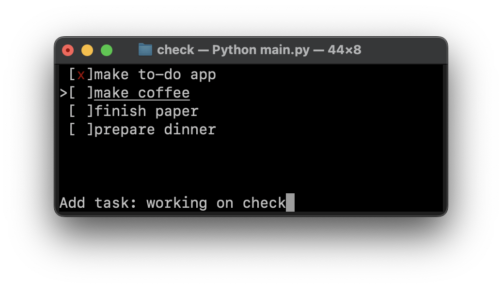

# Check

Check is a simple terminal based to-do app implemented in Python



## Requirements

* Python (`>=3.10`)

Check uses the `curses` module, this means there are no extra dependencies.

## Usage

Simply run:
```
python3 check.py
```
or
```
chmod +x check.py
./check.py
```
Check automatically makes creates a tasks.json file where all the tasks are saved.

### Commands

| Key        | Command     |
|:----------:|:-----------:|
| q          | exit        |
| j / \<down> | down        |
| k / \<up>   | up          |
| \<space>    | new task    |
| \<enter>    | (un)check   |
| d          | delete task |
| e          | edit task   |


